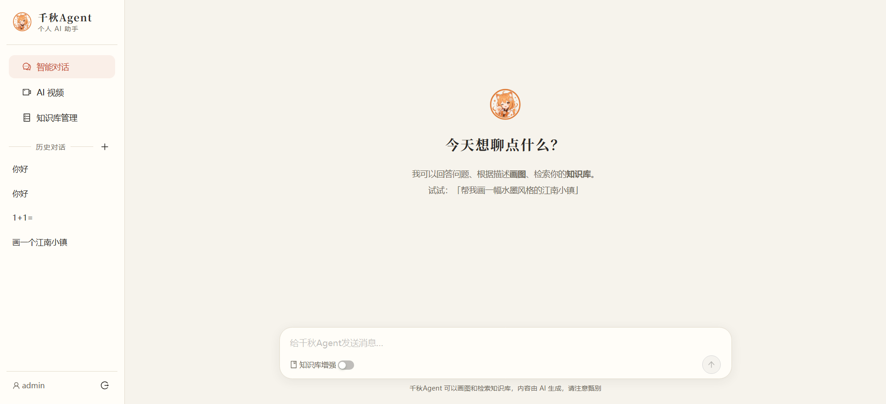
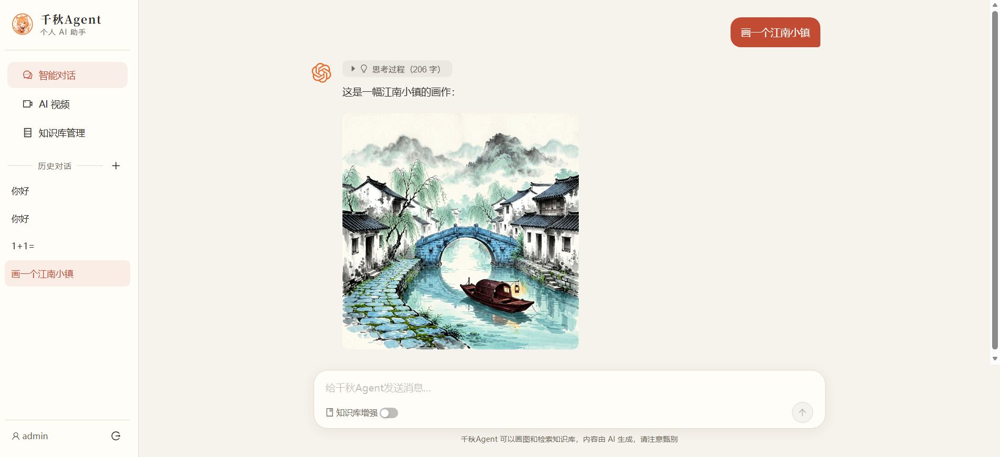

# 千秋Agent · 个人 AI Agent 网站

一个前后端分离的个人 AI Agent 应用：**Agent 工具调用（自主画图/检索知识库）、思维链展示、多会话持久化、注册登录**，外加 AI 绘画、AI 视频生成、知识库管理独立模块。


## 技术栈

| 层 | 技术 | 
|---|---|
| 后端 | Python · FastAPI · LangChain 0.3 · SQLite · JWT(bcrypt) |
| 前端 | React 18 · Vite · TypeScript · Ant Design 5 |
| RAG | HuggingFace `BAAI/bge-small-zh-v1.5` 本地向量化 · Chroma 持久化向量库 |
| 模型 | Agnes API：`agnes-2.0-flash`（对话+工具调用+思维链）/ `agnes-image-2.1-flash`（生图）/ `agnes-video-v2.0`（视频，异步轮询） |

## 架构说明

```
React 18 (5173)
   │  Vite proxy /api → 8000   (JWT Bearer)
   ▼
FastAPI (8000) ── 注册/登录(bcrypt+JWT) ── SQLite(用户/会话/消息/视频任务)
   │
   ├─ Agent 循环: ChatDeepSeek(bind_tools) ──→ Agnes /v1/chat/completions (SSE)
   │     ├─ 工具 generate_image ──→ Agnes /v1/images/generations
   │     ├─ 工具 search_knowledge_base ──→ Chroma 检索
   │     └─ SSE 帧: reasoning / delta / tool_call / tool_result / sources
   │
   ├─ RAG: bge-small-zh embedding + Chroma topK=4 注入 system prompt
   └─ httpx 代理 ──→ Agnes /v1/videos（创建）+ /agnesapi?video_id=（轮询）
```

- **Agent 工具调用**：对话模型通过 OpenAI function calling 自主决定画图或检索知识库，最多 3 轮工具循环，工具执行过程实时推送到前端
- **思维链展示**：`agnes-2.0-flash` 的 `reasoning_content` 经 `ChatDeepSeek` 透传，前端以可折叠"思考过程"面板流式展示（ChatOpenAI 会丢弃该字段，这是选型关键点）
- **持久化**：会话/消息（含思考过程、图片、引用来源）、视频任务全部按用户存入 SQLite，刷新/换设备不丢
- **鉴权**：bcrypt 密码哈希 + JWT（7 天有效期），所有功能接口未登录返回 401，前端统一拦截提示"请先登录"
- **API 密钥零暴露**：Agnes 密钥仅存后端 `.env`，全部经后端代理
- **流式输出**：SSE + `fetch ReadableStream` 逐字渲染，支持停止生成

## 快速启动

### 1. 后端

```bash
cd backend
python -m venv .venv
source .venv/Scripts/activate        # Windows Git Bash；PowerShell 用 .venv\Scripts\Activate.ps1
pip install -r requirements.txt
cp .env.example .env                 # 填入 AGNES_API_KEY 和 JWT_SECRET
uvicorn app.main:app --reload --port 8000
```

> 国内网络首次运行会从 hf-mirror.com 下载 embedding 模型（约 100MB），`.env` 中已配置 `HF_ENDPOINT`。

### 2. 前端

```bash
cd frontend
npm install
npm run dev
```

访问 http://localhost:5173 ，注册账号后使用。

## 功能模块

1. **智能对话（Agent）**：多会话侧栏、ChatGPT 式输入框、流式逐字输出、可折叠思考过程、自主调用画图/知识库工具（带过程卡片）、知识库增强开关、引用来源标签、停止生成
2. **AI 绘画**：提示词 + 尺寸选择，生成结果画廊（预览/放大/下载）
3. **AI 视频**：文生视频 / 图生视频（上传或 URL），任务持久化，多任务并行轮询，完成后在线播放
4. **知识库管理**：拖拽上传 txt/md/pdf/docx，自动切分向量化，文档列表与删除
